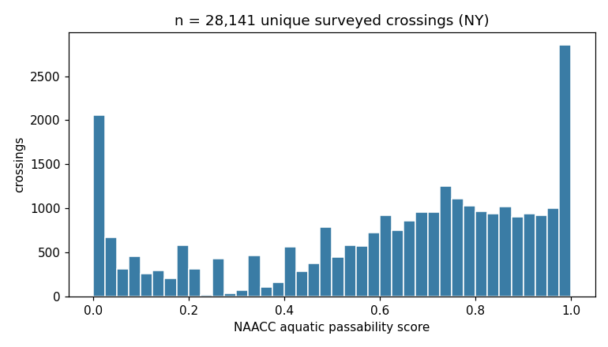
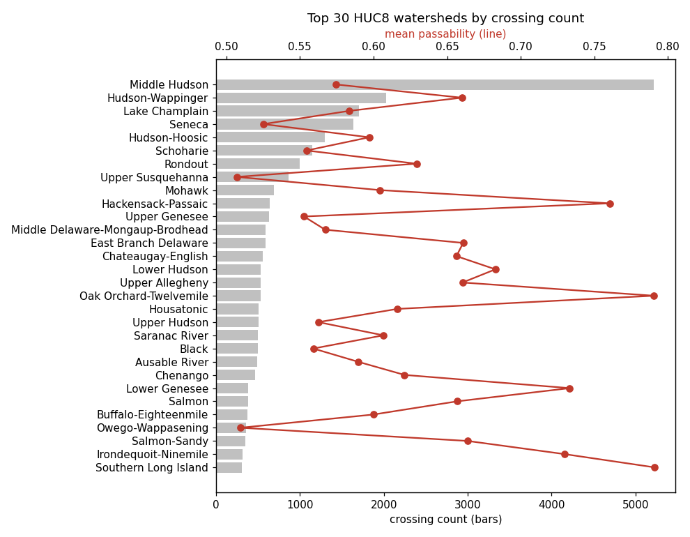
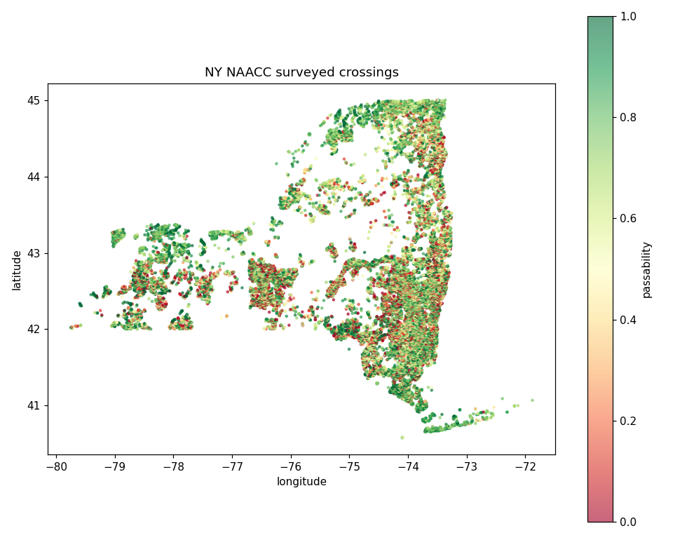
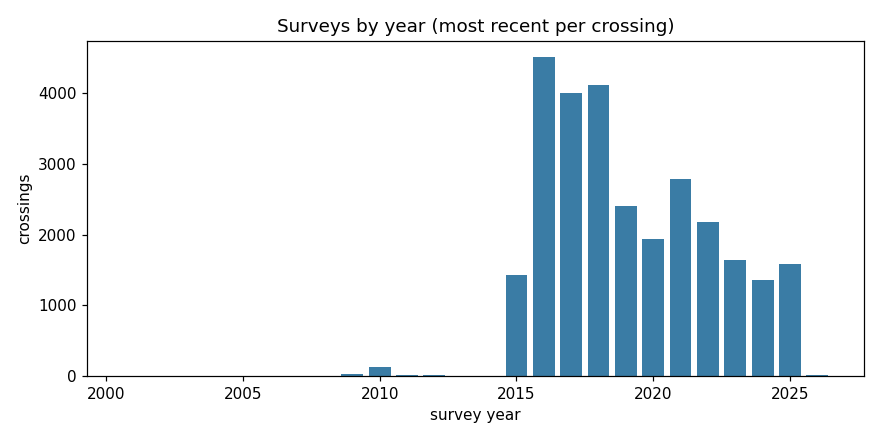
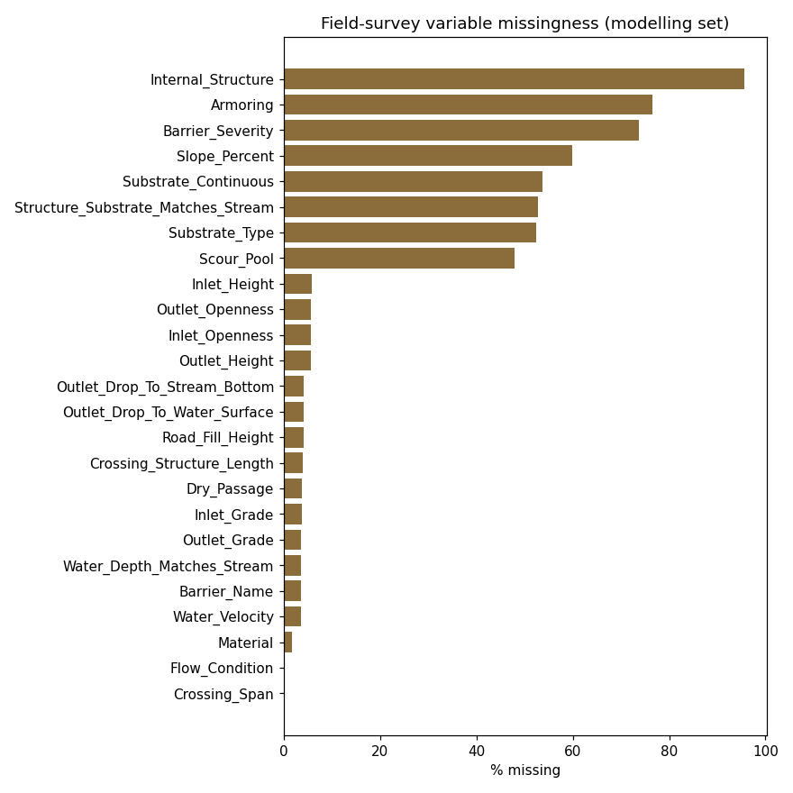

# NAACC New York passability data - Phase 1 audit

Source: NYS DEC ArcGIS FeatureServer `NYS_NAACCSurveys_Projected` (public, no login). See `data/raw/ny_naacc_PROVENANCE.json`.

## Raw export

| Question | Answer |
|---|---|
| Total survey records | 44,871 |
| Unique crossing codes | 38,846 |
| Unique survey ids | 41,010 |
| Records with a valid 0-1 passability score | 37,808 |
| Records with score = -1 (no score - missing data) | 7,063 |
| Tidal sites | 373 |
| Records with coordinates | 44,871 |
| Distinct HUC8 watersheds | 55 |
| Distinct counties | 58 |
| Crossing codes with >1 record | 4,906 (max 15 rows) |

Crossing codes appear more than once for two reasons: a crossing with multiple structures (each culvert is its own row) and repeat surveys of the same crossing over time. Both are resolved in cleaning.

## Cleaning to the modelling dataset

| Step | Records before | Records after | Dropped |
|---|---|---|---|
| raw survey records | 44,871 | 44,871 | 0 |
| valid NY coordinates | 44,871 | 44,871 | 0 |
| has a numeric Aqua_Pass_Score | 44,871 | 44,871 | 0 |
| score in [0, 1] (drops the -1 'no score - missing data' sentinel) | 44,871 | 37,808 | 7,063 |
| non-tidal (Tidal_Site != Yes) | 37,808 | 37,528 | 280 |
| accessible crossing with a structure | 37,528 | 34,729 | 2,799 |
| NAACC-approved records | 34,729 | 33,081 | 1,648 |
| collapse multi-structure rows (keep limiting structure) | 33,081 | 29,418 | 3,663 |
| keep most recent survey per crossing | 29,418 | 28,141 | 1,277 |

- Multi-structure rows are collapsed to the lowest-passability structure per (crossing code, survey date).
- Final modelling dataset: 28,141 unique surveyed crossings, 55 HUC8 watersheds, survey years 2001-2026.
- Target (passability) mean 0.614, median 0.695, fraction at 0.0: 4.8%, fraction at 1.0: 5.5%.

## Modelling dataset

- **28,141 unique surveyed crossings**
- 55 HUC8 watersheds (min 3, max 5215 crossings per watershed)
- 57 counties
- survey years 2001-2026 (median 2018)
- passability: mean 0.614, median 0.695, sd 0.312
- at exactly 0.0: 1,359 (4.8%); at exactly 1.0: 1,551 (5.5%)

### Crossing type

| Crossing_Type    |     n |
|:-----------------|------:|
| Culvert          | 19899 |
| Bridge           |  4135 |
| Multiple Culvert |  2436 |
| Bridge Adequate  |  1294 |
| Ford             |   377 |

### Road type

| Road_Type                 |     n |
|:--------------------------|------:|
| Paved                     | 21292 |
| Unpaved                   |  3850 |
| Trail                     |  1367 |
| Multilane road (>2 lanes) |   729 |
| Driveway                  |   584 |
| Railroad                  |   242 |
| No data                   |    77 |

### AOP class vs numeric score

| AOP                     |   count |   mean |   min |   max |
|:------------------------|--------:|-------:|------:|------:|
| Full AOP                |    5000 |  0.936 | 0.571 |     1 |
| No AOP                  |   10003 |  0.293 | 0     |     1 |
| Reduced AOP             |   12517 |  0.731 | 0     |     1 |
| no score - missing data |     621 |  0.852 | 0     |     1 |

### Missingness of field-survey variables (in the modelling dataset)

|                                    |   % missing |
|:-----------------------------------|------------:|
| Internal_Structure                 |        95.5 |
| Armoring                           |        76.5 |
| Barrier_Severity                   |        73.7 |
| Slope_Percent                      |        59.9 |
| Substrate_Continuous               |        53.8 |
| Structure_Substrate_Matches_Stream |        52.8 |
| Substrate_Type                     |        52.3 |
| Scour_Pool                         |        47.8 |
| Inlet_Height                       |         5.9 |
| Inlet_Openness                     |         5.6 |
| Outlet_Openness                    |         5.6 |
| Outlet_Height                      |         5.6 |
| Outlet_Drop_To_Stream_Bottom       |         4.2 |
| Outlet_Drop_To_Water_Surface       |         4.2 |
| Road_Fill_Height                   |         4.1 |
| Crossing_Structure_Length          |         4   |
| Dry_Passage                        |         3.7 |
| Inlet_Grade                        |         3.7 |
| Water_Depth_Matches_Stream         |         3.7 |
| Outlet_Grade                       |         3.7 |
| Barrier_Name                       |         3.6 |
| Water_Velocity                     |         3.6 |
| Material                           |         1.8 |
| Flow_Condition                     |         0   |
| Crossing_Span                      |         0   |

### Repeat-survey analysis (raw)

- crossings surveyed once: 36,782
- crossings surveyed 2+ times: 2,064
- max surveys of one crossing: 4

## Figures

