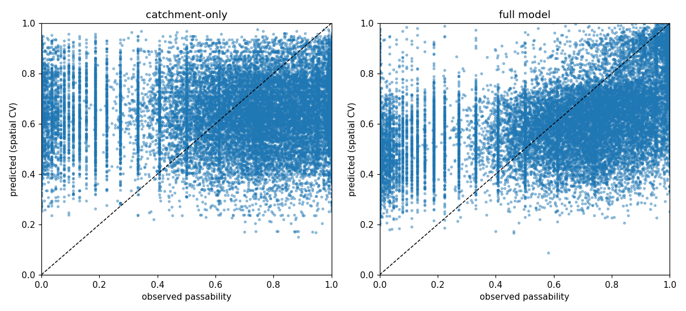
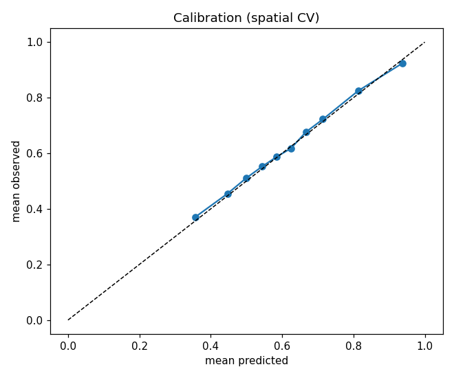
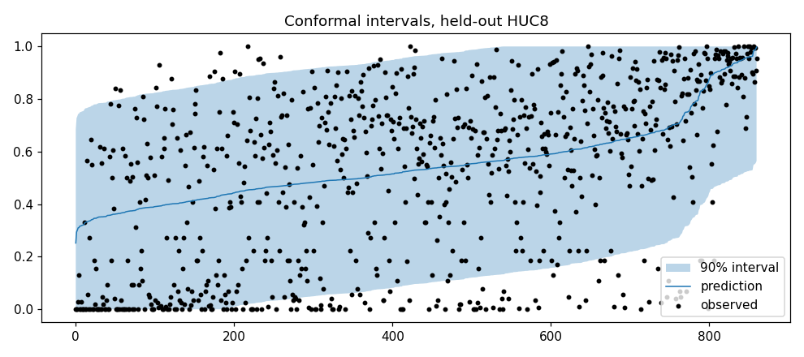

# NAACC passability - model comparison (NY statewide subset)

Subset: **21111 crossings** across **55 HUC8 watersheds** (NY, capped per watershed - see `src/build_subset.py`). Target mean 0.624, sd 0.310.

> Scope: a prototype-scale reproduction of the *structure* of the DSL / Plunkett GIS-prediction approach with a reduced predictor set. Not the full DSL feature engineering. See `reports/METHODOLOGY.md`.

DSL-reported baseline (full feature set, 13-state, OOB): **R2 = 0.31**, and it "generally doesn't predict the more extreme values".

## Hyperparameter tuning

One `RandomizedSearchCV` pass per tunable model (RF/ExtraTrees/HistGBM/XGBoost), scored by negative MAE under its own HUC8-group CV split (seeded independently of every split below). Not nested inside each individual reporting fold - see `models.py::tune_hyperparameters` for the honesty note on rigor vs. compute cost.

- **random_forest**: `{'est__n_estimators': 600, 'est__min_samples_leaf': 12, 'est__max_features': 0.5, 'est__max_depth': 16}`
- **extra_trees**: `{'est__n_estimators': 900, 'est__min_samples_leaf': 5, 'est__max_features': 0.7, 'est__max_depth': 16}`
- **hist_gbm**: `{'est__min_samples_leaf': 50, 'est__max_iter': 900, 'est__max_depth': 5, 'est__learning_rate': 0.12, 'est__l2_regularization': 4.0}`
- **xgboost**: `{'est__subsample': 0.85, 'est__reg_lambda': 4.0, 'est__n_estimators': 1000, 'est__max_depth': 3, 'est__learning_rate': 0.03, 'est__colsample_bytree': 0.6}`

## E0 - model ladder: random vs. spatial (HUC8) cross-validation, 5x repeated

Each `spatial`/`random` row is the mean over 5 independent splits (different random watershed-to-fold or row-to-fold assignments) - not a single split's number. `_std` columns show the spread across those repeats.

|                         |     n |   mae |   mae_std |   rmse |     r2 |   r2_std |   spearman |   pred_sd_ratio |
|:------------------------|------:|------:|----------:|-------:|-------:|---------:|-----------:|----------------:|
| random/mean             | 21111 | 0.256 |         0 |  0.31  | -0     |    0     |     -0.009 |           0.002 |
| random/linear           | 21111 | 0.215 |         0 |  0.27  |  0.242 |    0.004 |      0.529 |           0.504 |
| random/ridge            | 21111 | 0.215 |         0 |  0.27  |  0.245 |    0     |      0.531 |           0.499 |
| random/elasticnet       | 21111 | 0.215 |         0 |  0.27  |  0.243 |    0     |      0.529 |           0.484 |
| random/random_forest    | 21111 | 0.202 |         0 |  0.258 |  0.307 |    0.001 |      0.576 |           0.538 |
| random/extra_trees      | 21111 | 0.202 |         0 |  0.258 |  0.307 |    0.001 |      0.579 |           0.544 |
| random/hist_gbm         | 21111 | 0.203 |         0 |  0.26  |  0.301 |    0.001 |      0.575 |           0.547 |
| random/xgboost          | 21111 | 0.203 |         0 |  0.259 |  0.304 |    0.001 |      0.578 |           0.55  |
| random/voting_ensemble  | 21111 | 0.201 |         0 |  0.258 |  0.312 |    0.001 |      0.583 |           0.538 |
| spatial/mean            | 21111 | 0.256 |         0 |  0.311 | -0.003 |    0.001 |     -0.086 |           0.015 |
| spatial/linear          | 21111 | 0.22  |         0 |  0.274 |  0.219 |    0.001 |      0.506 |           0.508 |
| spatial/ridge           | 21111 | 0.219 |         0 |  0.274 |  0.221 |    0.001 |      0.507 |           0.503 |
| spatial/elasticnet      | 21111 | 0.218 |         0 |  0.273 |  0.224 |    0.001 |      0.508 |           0.486 |
| spatial/random_forest   | 21111 | 0.211 |         0 |  0.266 |  0.266 |    0.001 |      0.538 |           0.513 |
| spatial/extra_trees     | 21111 | 0.21  |         0 |  0.266 |  0.267 |    0.001 |      0.542 |           0.514 |
| spatial/hist_gbm        | 21111 | 0.21  |         0 |  0.266 |  0.263 |    0.002 |      0.542 |           0.539 |
| spatial/xgboost         | 21111 | 0.21  |         0 |  0.266 |  0.267 |    0.002 |      0.544 |           0.536 |
| spatial/voting_ensemble | 21111 | 0.21  |         0 |  0.265 |  0.273 |    0.001 |      0.548 |           0.518 |

The gap between `random/*` and `spatial/*` rows is the over-optimism of ordinary cross-validation for this problem.

Best spatial model (by mean MAE across repeats): **xgboost**.

## E1-E3 - the catchment-area investigation (spatial CV)

- **catchment-area only** (RF on drainage area): MAE 0.269 | RMSE 0.335 | R2 -0.166 | Spearman 0.062 | pred/obs sd 0.45
- **full best model**: MAE 0.210 | RMSE 0.266 | R2 0.267 | Spearman 0.544 | pred/obs sd 0.54
- **full model, catchment removed**: MAE 0.211 | RMSE 0.266 | R2 0.264 | Spearman 0.541 | pred/obs sd 0.53
- **residual stack** f_catchment + f_environment: MAE 0.234 | RMSE 0.298 | R2 0.079 | Spearman 0.421 | pred/obs sd 0.66

## E4 - permutation importance (spatial CV, MAE increase when shuffled)

|                                    |   mae_increase |     sd |
|:-----------------------------------|---------------:|-------:|
| road_class                         |         0.0024 | 0.0001 |
| terrain_slope_100m                 |         0.0006 | 0.0001 |
| lat                                |         0.0005 | 0.0001 |
| terrain_slope_500m                 |         0.0004 | 0.0002 |
| terrain_rough_100m                 |         0.0004 | 0.0001 |
| structure_length_m                 |         0.0002 | 0.0001 |
| county_income                      |         0.0002 | 0.0001 |
| structure_superstructure_condition |         0.0002 | 0.0001 |
| sc_pct_impervious                  |         0.0001 | 0.0001 |
| precip_24h_10yr_in                 |         0.0001 | 0.0001 |
| stream_slope                       |         0.0001 | 0.0001 |
| sc_pct_wetland                     |         0.0001 | 0.0001 |
| aadt                               |         0.0001 | 0.0001 |
| structure_num_spans                |         0.0001 | 0.0001 |
| structure_streambed_material       |         0      | 0.0001 |
| terrain_rough_500m                 |         0      | 0.0001 |
| structure_opening_width_m          |         0      | 0.0001 |
| structure_condition                |         0      | 0.0001 |
| sc_pop_density                     |         0      | 0.0001 |
| log_aadt                           |         0      | 0.0001 |
| sc_pct_forest                      |         0      | 0.0001 |
| structure_culvert_skew_deg         |        -0      | 0.0001 |
| log_drainage_area                  |        -0      | 0.0001 |
| stream_order                       |        -0      | 0.0001 |
| structure_material                 |        -0      | 0.0002 |
| drainage_area_km2                  |        -0      | 0.0001 |
| basin_span_km                      |        -0      | 0.0002 |
| structure_age_yr                   |        -0      | 0.0001 |
| sc_dam_density                     |        -0      | 0.0001 |
| sc_road_stream_crossing_density    |        -0.0001 | 0.0001 |
| sc_precip_mm                       |        -0.0001 | 0.0002 |
| sc_soil_perm                       |        -0.0001 | 0.0001 |
| structure_fhwa_status              |        -0.0001 | 0.0001 |
| sc_bedrock_depth_cm                |        -0.0001 | 0.0001 |
| ecoregion                          |        -0.0001 | 0.0001 |
| sc_pct_agriculture                 |        -0.0002 | 0.0001 |
| sc_baseflow_idx                    |        -0.0002 | 0.0001 |
| sc_road_density                    |        -0.0002 | 0.0001 |
| sc_runoff_mm                       |        -0.0002 | 0.0001 |
| structure_is_bridge                |        -0.0002 | 0.0001 |
| lon                                |        -0.0002 | 0.0001 |
| county_pop_density                 |        -0.0002 | 0.0002 |
| elev_m                             |        -0.0003 | 0.0001 |
| sc_wetness_index                   |        -0.0003 | 0.0001 |

## E5 - conformal prediction intervals

- held-out watershed: **Upper Susquehanna**, target coverage 90%
- empirical coverage: **87.1%**, mean interval width **0.81**

## E6 - calibration & predict-toward-the-mean

- max calibration gap (observed - predicted, decile bins): 0.014
- prediction / observation SD ratio (full model): **0.54** - reproduces the DSL 'toward the mean' pathology
- tail MAE (true low / high 15%): 0.436 / 0.175 vs overall 0.210

## E7 - does the environment model change which crossings are prioritised?

- bottom-20% ('worst crossings') list, catchment-only vs full model: Jaccard **0.12**, 3286 of 4222 crossings differ, rank correlation 0.09

## E8 - leave-one-HUC8-out: per-watershed breakdown

The full model, trained on every *other* watershed, evaluated on each watershed with >=40 crossings held out entirely on its own (not averaged into a pooled fold with others) - reveals whether performance is broad-based or driven by a few easy watersheds.

|                                  |    n |   mae |     r2 |   spearman |
|:---------------------------------|-----:|------:|-------:|-----------:|
| St. Regis                        |  197 | 0.12  |  0.377 |      0.646 |
| Raquette                         |  141 | 0.131 |  0.364 |      0.565 |
| Lower Genesee                    |  386 | 0.172 |  0.354 |      0.7   |
| Upper Genesee                    |  630 | 0.242 |  0.334 |      0.632 |
| East Branch Delaware             |  589 | 0.216 |  0.321 |      0.657 |
| Chautauqua-Conneaut              |   69 | 0.188 |  0.295 |      0.684 |
| Salmon                           |  383 | 0.152 |  0.288 |      0.529 |
| Buffalo-Eighteenmile             |  372 | 0.241 |  0.277 |      0.567 |
| Middle Delaware-Mongaup-Brodhead |  594 | 0.226 |  0.272 |      0.525 |
| Ausable River                    |  494 | 0.207 |  0.265 |      0.49  |
| Mohawk                           |  688 | 0.214 |  0.262 |      0.526 |
| Lake Champlain                   | 1000 | 0.2   |  0.257 |      0.515 |
| Cattaraugus                      |  286 | 0.246 |  0.255 |      0.526 |
| Irondequoit-Ninemile             |  317 | 0.131 |  0.251 |      0.564 |
| Middle Hudson                    | 1000 | 0.219 |  0.25  |      0.502 |
| Upper Susquehanna                |  861 | 0.241 |  0.247 |      0.525 |
| Hudson-Hoosic                    | 1000 | 0.223 |  0.242 |      0.488 |
| Upper Hudson                     |  509 | 0.217 |  0.222 |      0.445 |
| Niagara                          |  289 | 0.156 |  0.215 |      0.544 |
| Black                            |  500 | 0.206 |  0.213 |      0.393 |
| Chenango                         |  468 | 0.248 |  0.208 |      0.559 |
| Seneca                           | 1000 | 0.256 |  0.205 |      0.472 |
| Hudson-Wappinger                 | 1000 | 0.195 |  0.201 |      0.485 |
| Saranac River                    |  503 | 0.211 |  0.197 |      0.435 |
| Housatonic                       |  511 | 0.238 |  0.195 |      0.459 |
| Chemung                          |  170 | 0.251 |  0.194 |      0.457 |
| Grass                            |  217 | 0.155 |  0.192 |      0.365 |
| Owego-Wappasening                |  359 | 0.263 |  0.191 |      0.437 |
| Rondout                          |  999 | 0.219 |  0.189 |      0.468 |
| Schoharie                        | 1000 | 0.26  |  0.18  |      0.469 |
| Mettawee River                   |  184 | 0.206 |  0.178 |      0.388 |
| Salmon-Sandy                     |  346 | 0.177 |  0.177 |      0.445 |
| Oak Orchard-Twelvemile           |  534 | 0.117 |  0.175 |      0.468 |
| Chateaugay-English               |  560 | 0.173 |  0.124 |      0.34  |
| Lower Hudson                     |  536 | 0.22  |  0.122 |      0.442 |
| Oneida                           |   69 | 0.167 |  0.112 |      0.329 |
| Hackensack-Passaic               |  637 | 0.18  |  0.106 |      0.446 |
| Oswegatchie                      |  126 | 0.138 |  0.085 |      0.275 |
| Upper Delaware                   |  209 | 0.246 |  0.069 |      0.469 |
| Upper Allegheny                  |  535 | 0.234 |  0.062 |      0.407 |
| Sacandaga                        |   47 | 0.22  |  0.051 |      0.277 |
| Southern Long Island             |  311 | 0.122 | -0.125 |      0.256 |
| Bronx                            |  234 | 0.142 | -0.21  |      0.404 |
| Northern Long Island             |   99 | 0.166 | -0.557 |      0.338 |

**41 of 44** individually-held-out watersheds have positive R2.

## Figures

